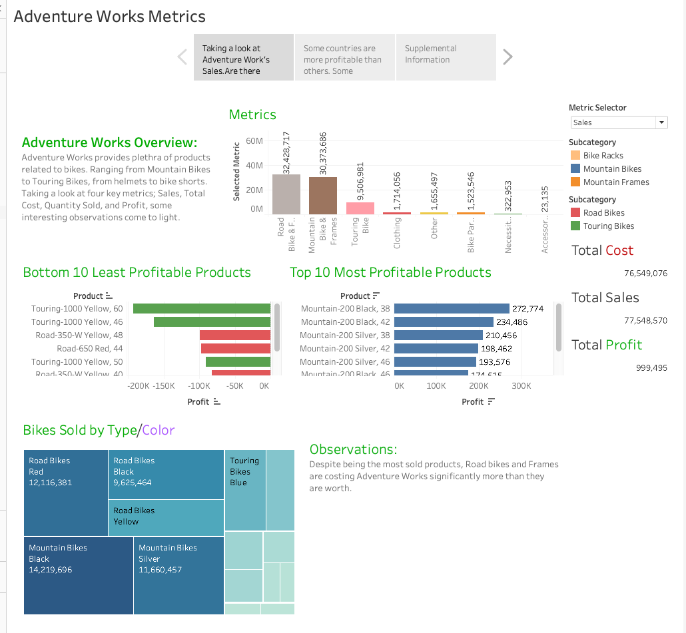
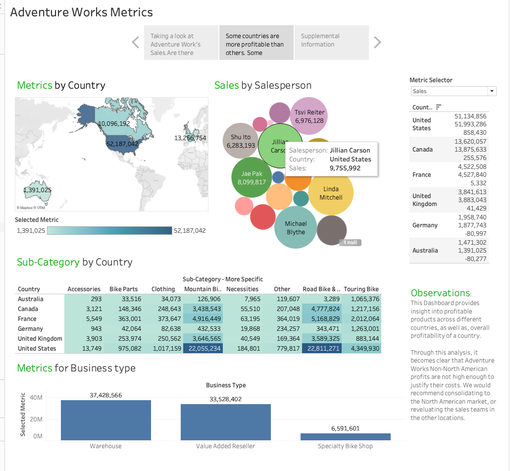
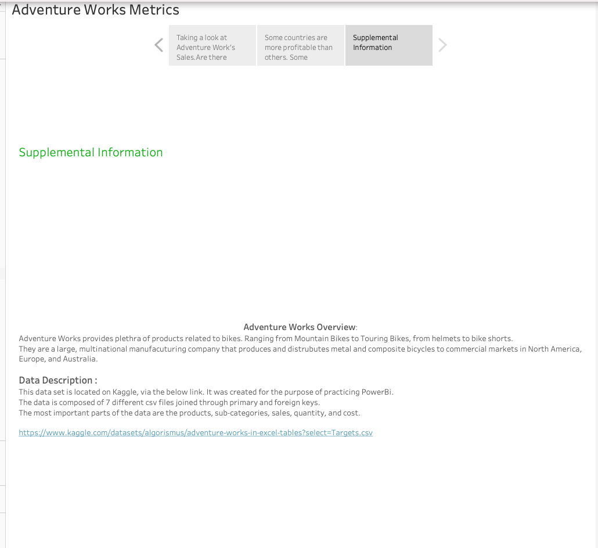

# 🚴‍♂️ Adventure Works Tableau Dashboard

This project analyzes sales and profitability performance for **Adventure Works**, a multinational bike manufacturer, using interactive dashboards built in Tableau.

The dashboard explores key business questions like:
- Which products and regions are most profitable?
- Which salespeople are driving the highest revenue?
- Are international markets worth the investment?

---

## 📊 Key Features

- **Map of Metrics by Country**  
  Identify top-performing regions based on Sales, Profit, Quantity, or Cost.

- **Top/Bottom 10 Products by Profit**  
  See which items bring the most (or least) value to the business.

- **Subcategory + Business Type Analysis**  
  Compare how different business channels contribute to the bottom line.

- **Interactive Metric Filters**  
  Quickly switch between performance metrics and subcategories.

- **Actionable Observations**  
  Commentary and suggestions included directly in the dashboard.

---

## 🖼️ Dashboard Previews

### 📌 Overall Metrics & Product Profitability

---

### 🌍 Global Sales & Subcategory Breakdown

---

### 📎 Supplemental Info

---

## 📁 Project Files

- 📈 [Download Tableau Workbook](./Tabluea%20Final%20Project.twbx)
- 🖼️ `Dashboard_1.png`, `Dashboard_2.png`, `Supplement.png`

---

## 🌐 Data Source

- Dataset from Kaggle:  
  [Adventure Works in Excel Tables](https://www.kaggle.com/datasets/algorismus/adventure-works-in-excel-tables)

---

## 💡 Observations & Recommendations

> While Adventure Works has a global reach, North American markets drive most of the profit. Some international regions have negative profit margins — suggesting a need to reevaluate costs, logistics, or sales strategies in those areas.

---

## 📫 Connect with Me

- 💼 [LinkedIn](https://linkedin.com/in/travis-moll-4974a21a9)
